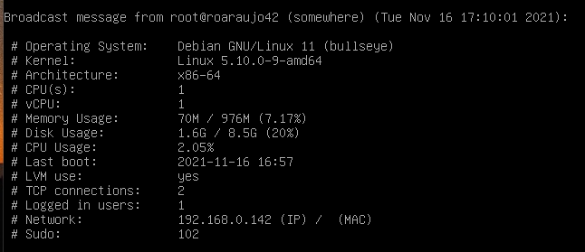

# Born2BeRoot
In this project I learned the basics of virtualisation, system administration and security policies in order to set up my very first basic SSH server!
The virtual machine was set up in Oracle Virtualbox. The chosen operating system was the latest stable release of Debian GNU/Linux (bullseye), and I used `apt` package manager to install the tools used to enforce minimal security policies, such as:
- setting up a firewall using `UFW`
- configuring system administration with `sudo`
- implementing strong password policy using `libpam-quality`
- setting up a `cron` task to run a monitoring script every 10 minutes

This project also covered the basics of **criptography**, **networking**, **hard disk partitioning**, and **shell scripting** (lots of output formatting!)

_You can find more about the making of this project [over here](https://beryl-allium-579.notion.site/Acelera-Born2BeRoot-99adac7a7bdc4bbf81b4eaf977625d5c) (in Portuguese 🇧🇷)_

## Summary
Password policies:
- minimum 10 characters
- must contain at least 1 upper case character and 1 digit
- must not contain username
- must be at least 7 chars different from one password update to the other
- must not contain more than 3 consecutive characters
- expires in 30 days
- minimum 2 days to change password
- system warning 7 days prior do expiry date

Firewall:
- all ports must be closed except for port 4242 

SSH
- default port changed to port 4242
- must not be able to connect using SSH as root

## Submission 
This projects submission is a SHA hash of the virtual machine in its final state prior to evaluation. It was necessary to take a snapshot within Virtualbox to save the VM state, as it would be altered during each project defense.
I've included in this repository the shell script used to make the monitoring panel as well.
